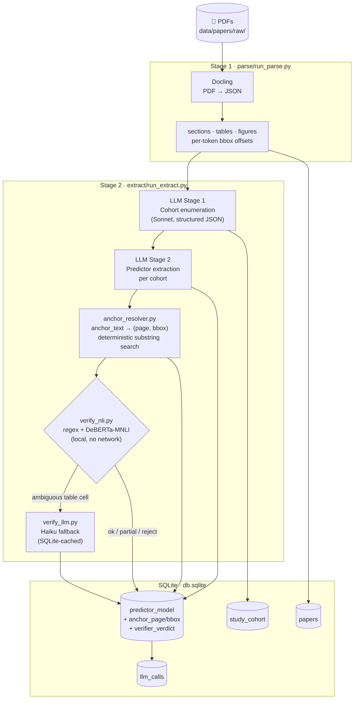
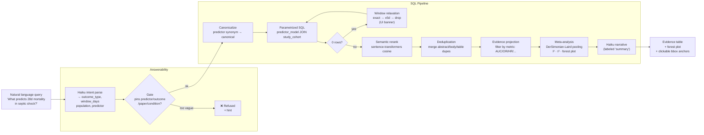
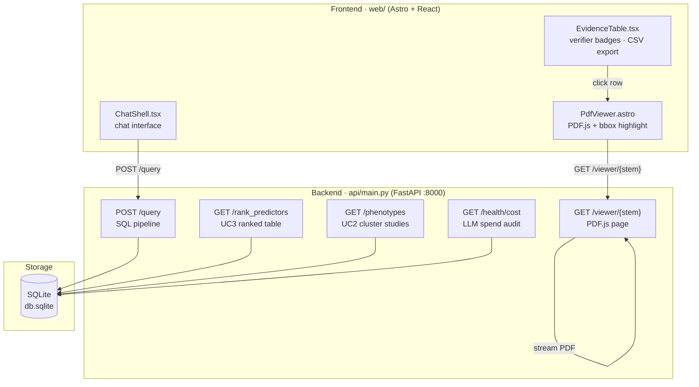

# SepsisAtlas

Turn sepsis research PDFs into a queryable, statistically-grounded evidence database. Every extracted number is anchored to exact bounding boxes in source documents. Numbers come from the database. Anchors come from deterministic substring matching. Prose comes from LLM summaries. Statistics come from Python.

## What It Does

Given 30+ sepsis research PDFs, the pipeline:

1. **Parses** each PDF with Docling — extracts sections, tables, figures, and per-token bounding boxes
2. **Extracts** structured evidence with a two-stage LLM agent (cohort enumeration → predictor/outcome rows)
3. **Resolves anchors** deterministically — maps `anchor_text` back to `(page, bbox)` via substring search (no LLM)
4. **Verifies** each row with a local NLI hybrid (regex + DeBERTa-MNLI), falling back to an LLM judge only for ambiguous table cells
5. **Stores** rows in SQLite with full provenance: model, prompt hash, verifier verdict, bbox, cost
6. **Queries** via a FastAPI backend — intent parsing → answerability gate → parametrized SQL → semantic reranking → random-effects meta-analysis → narrative
7. **Renders** in an Astro/React frontend with a split-pane chat + PDF viewer showing exact bbox highlights

## Ingest Pipeline



## Query Path



## System Architecture



## Database Schema

```mermaid
erDiagram
    papers {
        string file_name PK
        string doi
        string title
        int year
        string journal
        string pdf_hash
        string parser_version
        string run_id
    }
    study_cohort {
        string cohort_id PK
        string file_name FK
        string paper_ref
        string cohort_label
        int cohort_size_n
        float mortality_rate_pct
        string mortality_timepoint
        string anchor_text
        int anchor_page
        json anchor_bbox
        string verifier_verdict
        float verifier_score
    }
    predictor_model {
        string id PK
        string cohort_id FK
        string predictor_canonical
        string outcome_type
        int outcome_window_days
        string effect_size_str
        string effect_type
        float effect_value
        float ci_lo
        float ci_hi
        float auc
        float p_value
        string anchor_text
        int anchor_page
        json anchor_bbox
        string verifier_verdict
        float cost_usd
    }
    llm_calls {
        string id PK
        string run_id
        string stage
        string model
        int tokens_in
        int tokens_out
        float cost_usd
        float latency_ms
    }

    papers ||--o{ study_cohort : "has cohorts"
    study_cohort ||--o{ predictor_model : "has predictors"
    predictor_model }o--o{ llm_calls : "logged by"
```



## Repository Layout

```
src/
  sepsis_atlas/         shared: DB models, LLM wrapper, Pydantic schemas, config
  parse/                Docling PDF → JSON pipeline
  extract/              LLM extraction, anchor resolver, NLI + LLM verifiers
  api/                  FastAPI backend (query, ranking, viewer, meta-analysis)
  stats/                random-effects pooling, forest plot
web/                    Astro 5 + React 19 frontend
data/
  papers/raw/           input PDFs (gitignored)
  papers/parsed/        Docling JSON output (gitignored)
  ground_truth/         organizer gold-standard CSVs (4 papers)
tests/                  25+ pytest modules
scripts/                validation, eval, debug utilities
db.sqlite               SQL pipeline database
logs/llm_calls.jsonl    append-only LLM audit trail
runs/                   per-run manifests (cost, verdict counts)
```

## Setup

```bash
pip install -e .

cp .env.example .env
# fill OPENROUTER_API_KEY, LLM_PROVIDER, MODEL_* vars

# or Docker
docker compose up -d
```

Key environment variables:

```bash
LLM_PROVIDER=openrouter          # or claude-cli
OPENROUTER_API_KEY=...
MODEL_EXTRACT=anthropic/claude-opus-4.7
MODEL_VERIFY_LLM=anthropic/claude-haiku-4.5
MODEL_INTENT=anthropic/claude-haiku-4.5

DATABASE_URL=sqlite:///db.sqlite
```

## Running the Pipeline

```bash
# Stage 1: parse all PDFs in data/papers/raw/
python -m parse.run_parse --jobs 4

# Stage 2: extract cohorts + predictors
python -m extract.run_extract --gt-only   # ground-truth papers first (validation)
python -m extract.run_extract --all       # all papers (resumes from checkpoint)

# Serve
uvicorn api.main:app --host 0.0.0.0 --port 8000

# Frontend (dev)
cd web && npm run dev
```

Both parse and extract are resumable — already-processed papers are skipped unless `--force` is passed.

## Testing

```bash
pytest tests/
pytest tests/test_extraction_quality.py   # scores vs. gold-standard CSVs
pytest tests/test_anchor_resolver.py      # bbox accuracy
pytest tests/test_query_layer.py          # SQL builder + answerability gate
```

Validation against organizer ground-truth (4 papers: Gai 2022, Seymour 2016, Wang 2023, Zhang 2021):

```bash
python scripts/validate.py   # per-paper precision/recall, per-field accuracy
```

## Key Numbers (30 papers processed)

| Metric | Value |
|--------|-------|
| Cohorts extracted | 100 |
| Predictor rows | 2,394 |
| Verifier pass (ok) | 78.4% |
| Verifier partial | 16.5% |
| Verifier reject | 5.1% |

## Design Rules

**LLM never computes a number.** Numbers come from DB rows. If a row lacks a parsed numeric, the UI shows the raw free-text string — never an LLM interpolation.

**LLM never cites a source it didn't see.** Every row has `anchor_text` (verbatim substring from the paper) resolved to `(anchor_page, anchor_bbox)` by deterministic search. The verifier checks the anchor supports the claim before the row is stored.

**Answerability over completeness.** The query layer refuses vague queries rather than returning thousands of unranked rows.

## Stack

| Layer | Technology |
|-------|-----------|
| PDF parse | Docling |
| Extraction LLM | OpenRouter → Claude Sonnet / Opus |
| Verifier (Tier 1) | regex + DeBERTa-MNLI (local, no network) |
| Verifier (Tier 2) | Claude Haiku (SQLite-cached) |
| SQL database | SQLite (→ Postgres at scale) |
| Statistics | statsmodels (random-effects), matplotlib |
| Backend | FastAPI + Uvicorn |
| Frontend | Astro 5, React 19, Tailwind 4, PDF.js |
| Tracing | Langfuse (optional) |
