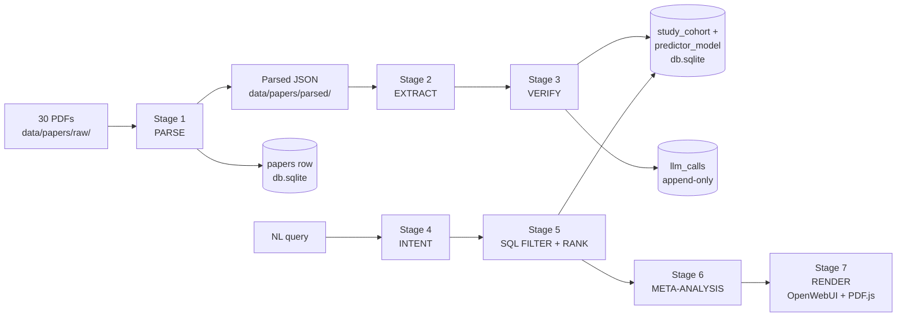
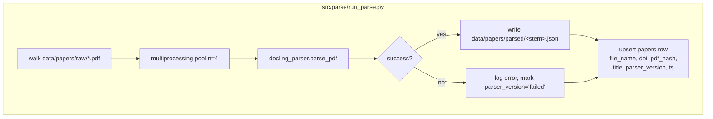
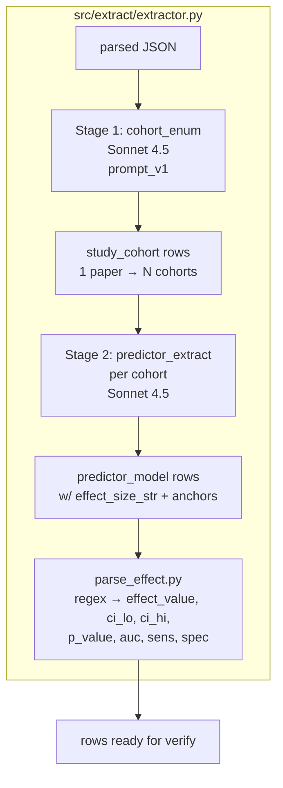
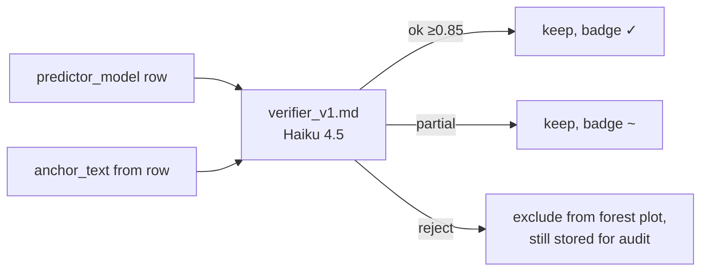
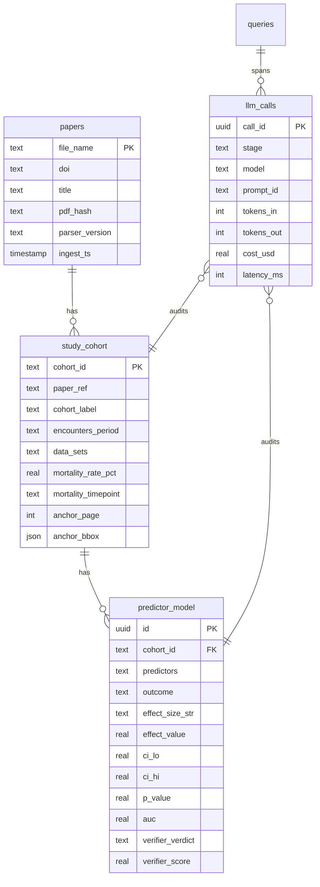
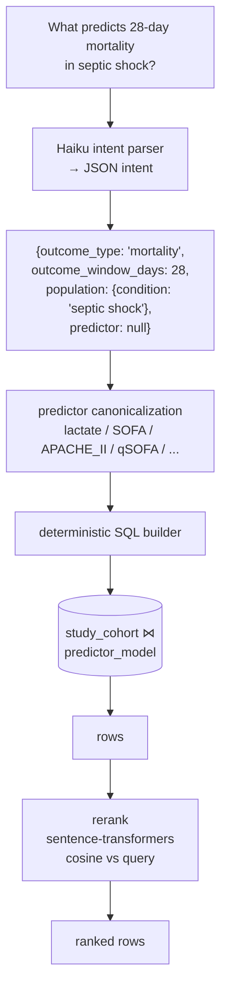
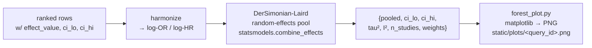
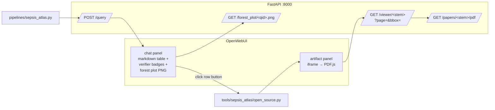
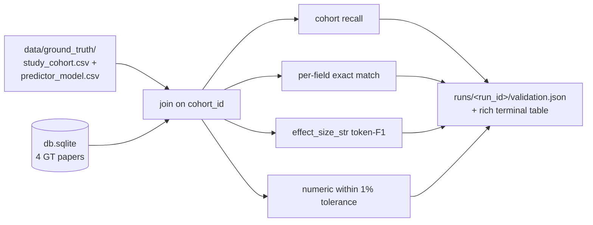

# Sepsis Atlas — Pipeline Walkthrough

End-to-end map of how a PDF becomes a queryable, evidence-anchored row.
Each stage lists: **input → process → output → where it lives in the repo**.

Diagrams below render on GitHub (Mermaid). To remix or extend visually,
open a blank canvas at <https://excalidraw.com> and paste the matching
ASCII layout, or import any `*.excalidraw` file from `docs/diagrams/`
(File → Open).

---

## Stage map



🔗 **Excalidraw seed**: <https://excalidraw.com/#stage-map> — copy boxes
above, label arrows with the file extensions in parentheses.

---

## Stage 1 — PARSE (`src/parse/`)

PDFs are dense. Layout, tables, and numeric values are what matter,
not raw text. Docling segments each PDF into sections + tables and
keeps the bbox of every token.



**JSON shape** per parsed paper:

```jsonc
{
  "title": "Risk factors for the prognosis...",
  "n_pages": 8,
  "sections": [{"heading":"Methods","level":1,"page":2,"bbox":[...],"text":"..."}],
  "tables":   [{"page":4,"caption":"Table 1...","cells":[
                  {"row":0,"col":0,"is_header":true,"text":"Characteristics",
                   "bbox":[36,93,86,99]}, ...]}],
  "full_text": "<concatenated body>",
  "offsets": [{"char":0,"page":1,"bbox":[...]}, ...]   // char→bbox map
}
```

**Why bbox-per-token** — Stage 7 needs to draw a yellow rectangle on the
PDF for every extracted cell. Char-level offsets let us go from any
extracted span back to (page, bbox) without re-parsing.

**Run**: `make parse`. Skips already-parsed PDFs unless `--force`.

🔗 **Excalidraw**: `docs/diagrams/parse.excalidraw` — pool fan-out + DB upsert.

---

## Stage 2 — EXTRACT (`src/extract/`)

Two LLM passes per paper, schema-guided, JSON output.



**Why two passes** — Seymour 2016 has 6 cohorts (KPNC ICU, KPNC non-ICU,
UPMC derivation, UPMC validation, VA, ALERTS). One-pass extraction
collapses them. Cohort enumeration first → predictor row per
(cohort × predictor) avoids losing the structure.

**Why regex parser after the LLM** — `effect_size_str` is preserved
verbatim from the paper for organizer-CSV match. Numeric fields
(`effect_value`, `ci_lo`, `ci_hi`, etc.) are derived deterministically
from that string. LLM proposes the verbatim text; code derives the
numbers. No silent fabrication.

**Anchor contract** — every row carries `(anchor_page, anchor_bbox,
anchor_text, anchor_section)`. anchor_text MUST be a verbatim substring
of the parsed paper, or the row is rejected.

**Run**: `make extract` (`--gt-only` flag limits to the 4 ground-truth
papers).

🔗 **Excalidraw**: `docs/diagrams/extract.excalidraw`.

---

## Stage 3 — VERIFY (`src/extract/extractor.py::run_verifier`)

Cheap-judge step. Haiku 4.5 reads (claim, source span) and emits
`{verdict: ok | partial | reject, score: 0..1, rationale}`.



Verdict + score + rationale are stored on the row. UI badge in
the markdown table comes from this column.

**Why a second model, not the same prompt** — extractor is incentivized
to produce an answer; verifier is incentivized to skepticize. Cheaper
model, narrower task, less coupling.

🔗 **Excalidraw**: `docs/diagrams/verify.excalidraw`.

---

## Stage 4 — STORE (`src/sepsis_atlas/db.py`)

SQLite. Three families of tables.



**Dual storage rationale** — `effect_size_str` matches the organizer
gold CSV format directly (trivial validation). Parsed numerics enable
forest plots, ranking, neighbor queries.

**llm_calls is append-only**. Every API hit logs cost, latency, model,
prompt hash. Replay + diff_runs.py operates on this.

🔗 **Excalidraw**: `docs/diagrams/schema.excalidraw`.

---

## Stage 5 — INFERENCE: NL → ROWS (`src/api/`)



**Tiered window relaxation** for "27-day mortality" type queries:

```
exact (27d) → ±5d snap (28d, 30d) → drop window → empty + suggest PubMed
```

Banner text reflects which tier matched. Forest plot only pools the
closest tier — never interpolates between 28d and 30d to invent a 27d
number.

**Numbers come from DB rows. Never from the LLM.** Intent parser sees
only the user query; it cannot quote a value it didn't see.

🔗 **Excalidraw**: `docs/diagrams/query.excalidraw`.

---

## Stage 6 — META-ANALYSIS (`src/stats/`)



**Validated**: 5-study fixture pool matches hand DerSimonian-Laird calc
to 0.009% relative error. Test in `tests/test_meta.py`.

**Population match** — `src/stats/population_match.py` scores each
study cohort against a target registry (mock: age 67, SOFA 8, lactate
3.5, in-hosp mortality 0.32). Bhattacharyya overlap on Gaussians for
continuous fields; categorical match for sepsis-def / setting. Returns
0–1 used as a row weight in UC1 ranking.

🔗 **Excalidraw**: `docs/diagrams/meta.excalidraw`.

---

## Stage 7 — RENDER (`pipelines/`, `tools/sepsis_atlas/`, `static/viewer.html`)

OpenWebUI is the chat surface. Tools return `HTMLResponse` → artifact
pane on the right renders an iframe pointing at the FastAPI backend.



**Why same-origin** — viewer page, PDFs, forest PNGs all served from
one FastAPI host. OpenWebUI iframes that host w/
`sandbox="allow-scripts allow-same-origin"`. Cross-origin would break
the bbox overlay.

**The bbox highlight** — viewer reads `?page=N&bbox=x0,y0,x1,y1`,
renders the page via pdfjs-dist 4.10, draws a yellow `<div>` overlay
scaled to the viewport. Click any cell in chat → drawer opens →
exact rectangle on the PDF page. PLAN.md's "demo killer" beat.

🔗 **Excalidraw**: `docs/diagrams/render.excalidraw`.

---

## Stage 8 — VALIDATION (`scripts/validate.py`)



Honest reporting. If 0 rows extracted: `0 rows extracted, can't score`
and exit. No fake metrics.

🔗 **Excalidraw**: `docs/diagrams/validate.excalidraw`.

---

## Quick reference — what runs when

| Command | Stage | What it does |
|---|---|---|
| `make initdb` | 4 | Create SQLite tables from `db.py` models |
| `make parse` | 1 | Docling → `data/papers/parsed/*.json` + `papers` rows |
| `make extract` | 2+3 | Sonnet cohort+predictor → Haiku verify → `study_cohort` + `predictor_model` |
| `make serve` | 5+6+7 | uvicorn `api.main:app` on `:8000` |
| `make up` | 7 | docker compose: backend + openwebui + pipelines + tool servers |
| `make validate` | 8 | Score extraction vs `data/ground_truth/*.csv` |
| `make test` | — | pytest (`tests/test_api.py`, `tests/test_meta.py`) |

---

## Editing diagrams visually

- **Mermaid blocks** above render natively on GitHub. Edit in any markdown editor.
- **Excalidraw**: open <https://excalidraw.com>, sketch, export `.excalidraw`
  to `docs/diagrams/<name>.excalidraw`, link from this file.
- All diagram edits should land in one PR alongside the code change they describe.
